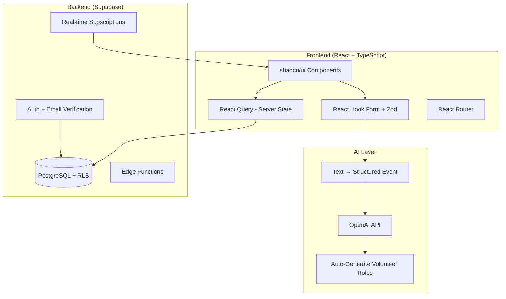

# UMMA Stewards — Community Event Management Platform

A full-stack event management platform built for community organizations to create, manage, and staff events with volunteer coordination, analytics, and AI-assisted workflows. **Currently in production use.**


## The Problem

Community organizations juggle dozens of recurring events — each with different volunteer needs, time slots, and logistics. Coordinators were managing everything through spreadsheets and group chats, leading to no-shows, over/under-staffing, and zero visibility into what was working.

## What It Does

- **AI-Assisted Event Creation** — Describe an event in plain text and the system parses it into a structured event with time slots, roles, and volunteer allocations using OpenAI's API
- **Volunteer Management** — Role-based sign-ups with gendered slot allocation (brother/sister/flexible), attendance tracking, and automatic headcount management
- **Event Templates** — Save and reuse configurations for recurring community events
- **Analytics Dashboard** — Attendance trends, volunteer engagement metrics, and event performance data (Recharts)
- **Email Notifications** — Automated confirmations and reminders with Outlook-optimized HTML templates
- **Admin Mode** — Full CRUD with visibility controls, event sharing, and deletion recovery
- **Auth System** — Email-based authentication with verification, forgot password flow, and session management

## Architecture



## Technical Highlights

- **NLP Event Parsing** — The AI component (`AITextToEventInput.tsx`) takes free-form text like "Friday prayer cleanup, need 5 brothers and 3 sisters, 2pm-4pm at the main hall" and extracts: title, date/time, location, description, and generates volunteer role objects with slot counts and gender allocation. Includes real-time preview before applying to the form.
- **Production Deployment** — Deployed on Netlify with Supabase backend. Serving real community events with actual volunteer sign-ups and attendance tracking.
- **Multi-Role Volunteer System** — Volunteers sign up for specific roles within events. The system tracks attendance, manages capacity per role, and handles the gendered slot allocation common in community organizations.
- **Optimistic Updates** — React Query handles server state with optimistic UI updates for a responsive feel even on slower connections.
- **Row Level Security** — All Supabase queries go through PostgreSQL RLS policies, ensuring users only see/modify their own data.

## Tech Stack

| Layer | Technology |
|-------|-----------|
| Frontend | React 18, TypeScript, Vite |
| UI | shadcn/ui, Radix UI primitives, Tailwind CSS, Lucide icons |
| State | TanStack React Query |
| Forms | React Hook Form + Zod validation |
| AI | OpenAI API (GPT) |
| Backend | Supabase (PostgreSQL + Auth + Edge Functions + Real-time) |
| Charts | Recharts |
| Email | Custom HTML templates (Outlook-compatible) |
| Deploy | Netlify |

## Running Locally

```bash
git clone https://github.com/thisisyoussef/event-scribe-ai-assist.git
cd event-scribe-ai-assist
npm install
```

Create a `.env` file:
```env
VITE_SUPABASE_URL=your_supabase_url
VITE_SUPABASE_ANON_KEY=your_anon_key
VITE_OPENAI_API_KEY=your_openai_key
```

```bash
npm run dev        # Dev server at localhost:5173
npm run build      # Production build
```

## Project Structure

```
src/
├── components/
│   ├── analytics/              # Dashboard, summary views (Recharts)
│   ├── event-creation/         # AI text input, templates, itinerary editor
│   │   ├── AITextToEventInput.tsx   # NLP free-text → structured event
│   │   ├── EventSharingDialog.tsx
│   │   ├── ItineraryEditor.tsx
│   │   └── PreEventTasksManager.tsx
│   ├── ui/                     # shadcn/ui primitives
│   ├── Navigation.tsx
│   ├── TodayEvents.tsx
│   └── UpcomingEvents.tsx
├── hooks/                      # Custom React hooks
├── integrations/               # Supabase client config & generated types
├── pages/                      # Route-level components
└── utils/                      # Helpers, formatters
```
